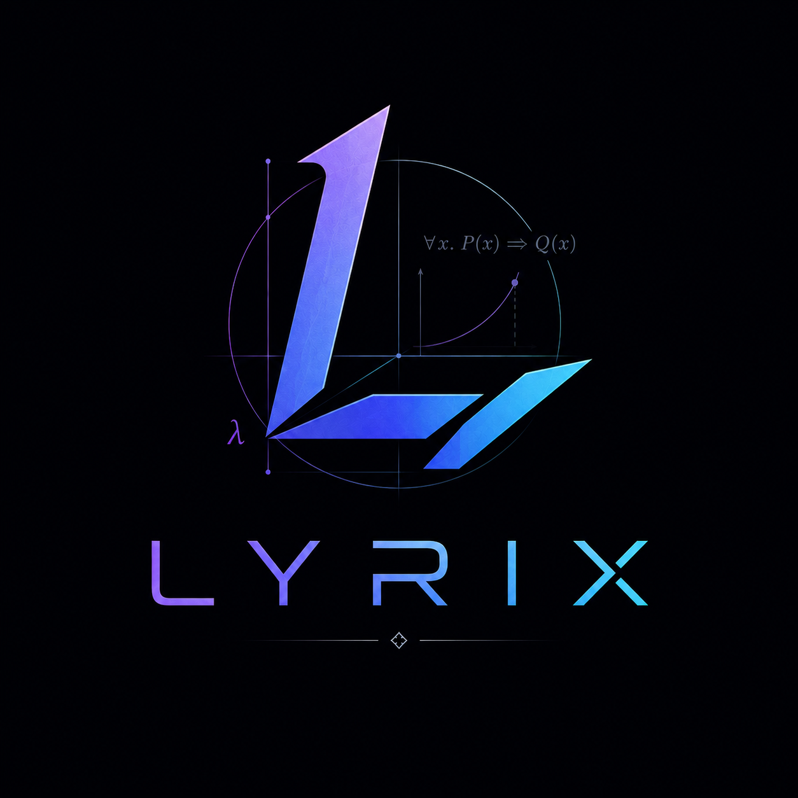

> A systems programming language focused on safety, ergonomics, performance, and mathematical expressiveness.

## Overview

Lyrix is a modern systems programming language designed for developers who need low-level control without sacrificing correctness, productivity, or performance.

The language combines four fundamental pillars:

- **Safety** — Prevent entire classes of bugs through strong static analysis and sound language design.
- **Ergonomics** — Reduce boilerplate and cognitive overhead without hiding complexity when it matters.
- **Performance** — Deliver predictable, zero-cost abstractions suitable for systems software.
- **Mathematics** — Treat mathematical concepts as first-class tools for reasoning about programs.

Lyrix aims to be a language where writing efficient software and writing correct software are not competing goals.

---

## Goals

### Safety Without Fear

Systems programming often forces developers to choose between control and safety.

Lyrix seeks to eliminate common sources of undefined behavior, including:

- Use-after-free
- Data races
- Uninitialized memory access
- Invalid references
- Integer safety pitfalls
- Resource leaks

while preserving direct access to memory, hardware, and operating-system facilities when required.

---

### Ergonomic by Default

Powerful languages often become difficult to read, learn, and maintain.

Lyrix emphasizes:

- Consistent language rules
- Expressive type systems
- Strong type inference
- Clear diagnostics
- Discoverable APIs
- Readable abstractions

The goal is to make the correct solution the easiest one to write.

---

### Performance as a Language Feature

Performance should not be an afterthought.

Lyrix is designed around:

- Zero-cost abstractions
- Predictable memory layouts
- Efficient compilation
- Cache-friendly programming
- Explicit control over allocations
- Compile-time computation

Programs should be able to compete with hand-written C and C++ implementations without requiring unsafe workarounds.

---

### Mathematics as a Foundation

Software is ultimately a mathematical construct.

Lyrix embraces mathematical thinking through features inspired by:

- Type theory
- Algebraic structures
- Set theory
- Category theory
- Formal verification
- Constraint solving

Mathematical concepts should be accessible to everyday programmers while remaining powerful enough for advanced users.

Examples include:

- Algebraic data types
- Pattern matching
- Refinement and constrained types
- Compile-time proofs
- Dimensional analysis
- Strong generic reasoning

---

## Design Principles

### Correctness First

Language design decisions prioritize correctness and reliability before convenience.

### Explicit Where It Matters

Critical operations involving ownership, synchronization, allocation, and effects should remain visible in source code.

### Abstractions Must Pay for Themselves

Every abstraction should either:

- Compile away entirely, or
- Provide measurable value that justifies its cost.

### Mathematical Consistency

Language rules should be explainable through coherent models rather than collections of special cases.

### Systems Programming Remains Systems Programming

Lyrix is not trying to hide the machine.

Developers should understand:

- Memory
- Concurrency
- CPU architecture
- Data representation
- Resource management

while receiving significantly stronger correctness guarantees.

---

## Requirements

### Setup PATH

Add Lyrix's binary path to the PATH environment variable.


### Node.js, NPM, TypeScript

Latest versions, always.

Then run:

```bash
cd Source/Aura
npm install
cd ../..
```

That will install the node dependencies of Aura.

### Compilers

Lyrix requires a compiler with full C++26 support:

| Compiler | Minimum Version |
|----------|-----------------|
| Clang    | 24+             |
| GCC      | 17+             |
| MSVC     | 14.52+          |


### Build System

| Tool  | Minimum Version |
|-------|-----------------|
| CMake | 4.3.3+          |
| Ninja | 1.13+           |


### Architectures

| Architecture |
|--------------|
| x86\_64      |
| ARM64        |


### Operating Systems

| OS      | Minimum version |
|---------|-----------------|
| Linux   | 7.0+            |
| macOS   | 27.0+           |
| Windows | 11 26H1+        |

---

## Getting Started

### Clone

```bash
git clone https://github.com/Netxonica/Lyrix.git
cd Lyrix
```


### Build

First, make sure you accomplish all the requirements. Then, do the following:

```bash
cmake -B Build/{Debug|Release} -S . -G Ninja -D CMAKE_BUILD_TYPE={Debug|Release}
ninja create_symlink -C Build/{Debug|Release}
ninja -C Build/{Debug|Release}
```

CMake will also compile Aura, the LSP client.


### Visual Studio Code integration (optional)

- Install Python 3 to use the release task (optional).
- Install the recommended extensions in `.vscode/extensions.json`.
- Define the following environment variables within PATH:
    - `LYRIX_GDB_PATH`: The path to the GDB binary (optional, only required when debugging with GDB.)
    - `LYRIX_LINKER_PATH`: The path to the linker binary.
    - `LYRIX_COMPILER_PATH`: The path to the C++ compiler.
- Use the 'Run and Debug' view to compile and debug.

---

## Testing

Every documented feature is tested thoroughly under the `Test` folder. These also showcase how the features are meant to be used.

---

## License

See [LICENSE](LICENSE.md) for details.